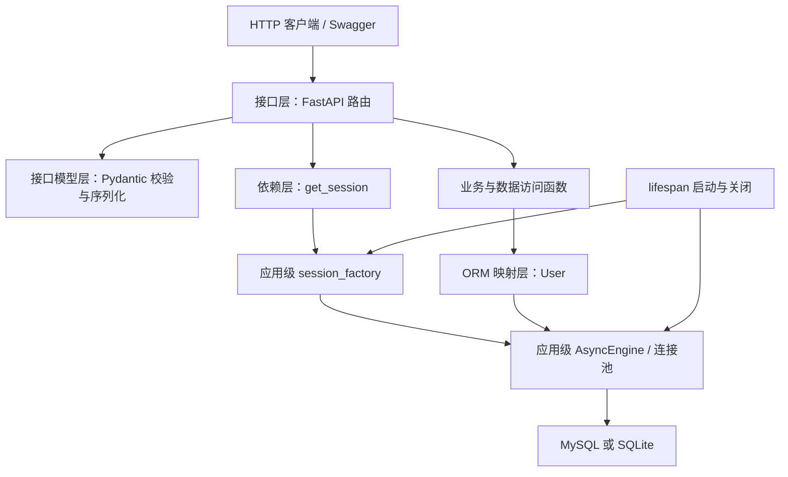
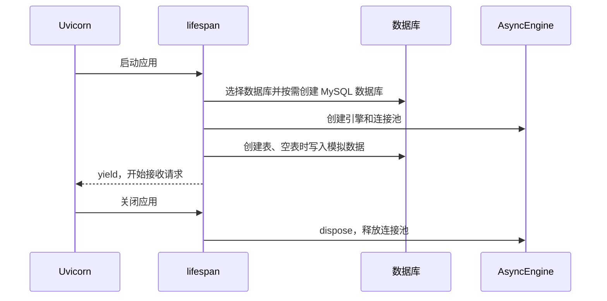
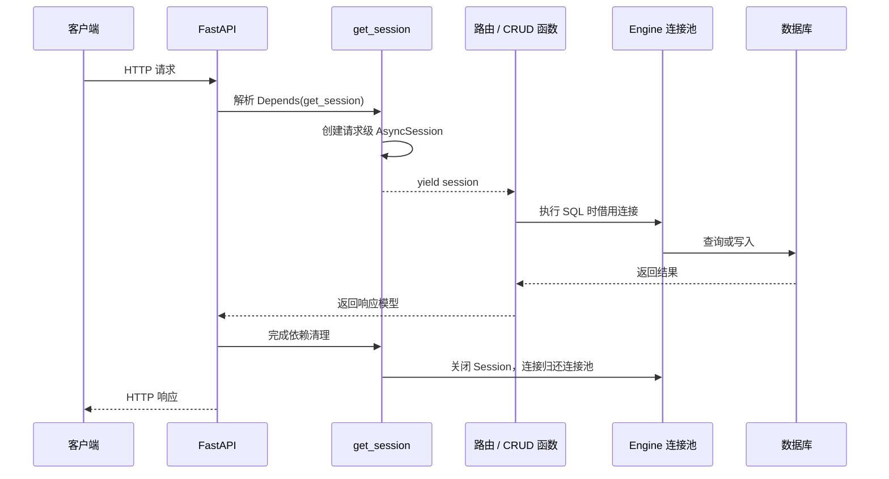

# `main.py` 软件工程设计与架构说明

## 1. 文档目标

`main.py` 是一个用于学习 FastAPI、SQLAlchemy 2.0 异步 ORM 和数据库 CRUD 的单文件应用。它把配置、数据库初始化、ORM 模型、HTTP 数据模型、业务操作和路由放在一个文件中，便于顺序阅读和运行。

这种结构适合教学、小型原型和概念验证。随着功能增长，应按职责拆分模块，而不是持续扩大单文件。

## 2. 系统解决的问题

应用启动后完成以下工作：

1. 根据环境变量选择 MySQL 或 SQLite。
2. 使用 MySQL 时，检查并创建 `fastapidba` 数据库。
3. 创建 SQLAlchemy 异步引擎和连接池。
4. 根据 ORM 模型创建 `orm_users` 表。
5. 空表时生成教学用模拟数据。
6. 对外提供用户数据的查询、新增、修改、删除和演示接口。
7. 应用关闭时释放数据库连接池。

它目前是“用户数据 CRUD 示例”，不是完整的用户系统。代码没有登录、密码、Token、Cookie、角色、权限或“只能操作本人数据”的规则。

## 3. 单文件中的逻辑分层

虽然代码都在 `main.py`，仍然可以按软件工程职责理解为多个层次：



各层职责如下：

| 代码区域 | 主要职责 | 不应承担的职责 |
| --- | --- | --- |
| 配置函数 | 决定数据库类型并读取连接参数 | 处理 HTTP 请求 |
| `lifespan` | 初始化和释放应用级资源 | 承担每次请求的业务逻辑 |
| ORM 模型 | 描述 Python 对象与数据库表的映射 | 决定接口暴露哪些字段 |
| Pydantic 模型 | 校验请求、定义响应结构 | 管理数据库连接 |
| 业务/数据函数 | 执行 CRUD、提交或回滚事务 | 创建全局引擎 |
| FastAPI 路由 | 接收参数、依赖注入、组织响应 | 重复实现底层 SQL 细节 |

## 4. 启动与关闭流程

`FastAPI(..., lifespan=lifespan)` 把资源管理交给 `lifespan()`：



放在生命周期函数中的资源只创建一次：

- `engine`：应用级数据库入口，内部维护连接池。
- `session_factory`：应用级会话工厂，用来快速创建请求级 `AsyncSession`。
- `database_description`：用于健康检查和日志展示的数据库描述。

这些对象保存到 `app.state`，供依赖函数或路由在应用运行期间读取。

## 5. 三种容易混淆的“会话”

### 5.1 SQLAlchemy `AsyncSession`

`get_session()` 创建的是数据库会话。它负责：

- 执行查询；
- 跟踪当前工作单元中的 ORM 对象；
- 保存尚未提交的新增、修改和删除；
- 提交或回滚数据库事务；
- 按需从连接池借用数据库连接。

它不代表登录用户，也不会自动保存用户身份。

### 5.2 登录会话

登录会话属于认证系统，常见实现包括：

- 客户端保存 JWT，每次请求通过 `Authorization` 请求头发送；
- 浏览器保存带会话标识的安全 Cookie，服务端在 Redis 或数据库中保存登录状态；
- 短期访问令牌配合长期刷新令牌。

如果要实现“用户只能删除自己的数据”，应先通过认证依赖得到 `current_user`，再把用户身份加入查询条件，例如同时校验记录 ID 和所有者 ID。仅有 `AsyncSession` 无法提供这种权限隔离。

### 5.3 数据库连接

数据库连接是 Engine 连接池中的底层网络连接。Session 不一定在创建时立即占用连接，通常在第一次执行 SQL 时才借用，并在事务或 Session 结束后归还连接池。

因此三者的典型生命周期不同：

| 对象 | 典型生命周期 | 当前项目是否实现 |
| --- | --- | --- |
| `AsyncEngine` 和连接池 | 应用启动到关闭 | 是 |
| `AsyncSession` | 一次 HTTP 请求 | 是 |
| 登录会话或 Token | 多次 HTTP 请求，可持续数分钟或数天 | 否 |

## 6. 为什么每个 HTTP 请求使用独立 Session

一次 HTTP 请求通常代表一个独立工作单元。例如“修改用户余额”可能包含查询用户、修改属性和提交事务。让该请求独占一个 Session 有以下原因：

1. **事务隔离**：某个请求未提交的修改不会混入另一个请求的事务。
2. **并发安全**：`AsyncSession` 是有状态对象，不适合被多个并发请求共享。
3. **对象状态隔离**：Session 内部维护 ORM 对象的身份映射和状态，按请求隔离可避免读到其他请求留下的旧对象状态。
4. **异常清理**：请求失败时可以回滚本次请求尚未提交的事务，而不影响其他请求。
5. **资源可控**：响应结束后关闭 Session，底层连接及时归还连接池。

请求流程如下：



## 7. Session 的“时效性”

当前数据库 Session 没有“30 分钟后过期”一类固定时效。它的边界由一次请求决定：

- FastAPI 开始处理使用 `SessionDependency` 的请求时创建；
- 路由及其调用的 CRUD 函数在本次请求中共享它；
- 响应完成或请求抛出异常后退出 `async with`，Session 被关闭；
- 异常到达依赖函数时，代码先尝试回滚尚未提交的事务。

这里的“请求级生命周期”是资源所有权设计，不是按秒计时的缓存。实际系统中的下列超时应单独配置：

- HTTP 请求超时：通常由反向代理、网关或 ASGI 服务配置；
- 数据库连接和查询超时：由驱动、SQLAlchemy 或数据库服务配置；
- 连接池回收时间：由 SQLAlchemy 连接池参数配置；
- 用户登录过期时间：由 JWT 或服务端登录会话策略配置。

`expire_on_commit=False` 也不是会话超时时间。它表示提交事务后，已经加载的 ORM 属性不会立即被标记为过期，路由可以在提交后直接把对象序列化为响应。

## 8. 事务边界和异常处理

当前 CRUD 函数采用显式提交：

- `create_user_record()`、`update_user_record()`、`delete_user_record()` 自己调用 `commit()`；
- 唯一邮箱冲突触发 `IntegrityError` 时，函数调用 `rollback()` 并转换成 HTTP 409；
- `get_session()` 对传播到依赖层的其他异常再次执行保护性回滚；
- 查询操作通常不需要提交。

这种写法便于教学，因为每个 CRUD 的事务行为都可见。但 `/demo/crud` 在一个请求中调用多个会自行提交的函数，所以整个演示不是一个不可分割的原子事务。正式业务如果要求“所有步骤全部成功或全部失败”，应让服务层统一控制一次事务，而让底层数据访问函数只修改对象和 `flush()`，不要各自提交。

## 9. ORM 模型与接口模型为什么分开

`User` 是 SQLAlchemy ORM 模型，决定 `orm_users` 表的列、主键、唯一约束和默认值。

`UserCreate`、`UserUpdate`、`UserResponse` 等是 Pydantic 模型，分别决定：

- 创建接口允许客户端提交哪些字段；
- 更新接口哪些字段可选以及如何校验；
- 响应允许客户端看到哪些字段；
- 分页、统计和演示接口的 JSON 结构。

分离后，即使数据库将来增加内部审计字段、密码摘要或删除标记，也不会因为直接返回 ORM 对象的所有字段而意外泄露。

## 10. 异步设计的作用

数据库连接、执行 SQL 和读取结果都是 I/O 操作。`await` 等待数据库响应时，事件循环可以处理其他请求，而不是让当前线程一直空等。

异步提高的是 I/O 等待期间的并发利用率，不会自动让慢 SQL 变快，也不能替代索引、分页、连接池容量和数据库性能优化。一个 `AsyncSession` 仍应在所属请求内按清晰顺序使用，不应让多个并发任务同时操作同一个 Session。

## 11. 当前 API 的请求链路示例

以 `POST /users` 为例：

1. FastAPI 根据 `UserCreate` 校验 JSON 请求体。
2. `Depends(get_session)` 创建请求级 `AsyncSession`。
3. 路由调用 `create_user_record(session, payload)`。
4. ORM 创建 `User` 对象并加入 Session。
5. `commit()` 生成并执行 `INSERT`。
6. 邮箱重复时回滚并返回 HTTP 409。
7. 成功时 `refresh()` 读取数据库生成的 ID 和时间。
8. FastAPI 根据 `UserResponse` 转换为 JSON。
9. 请求结束，Session 关闭，数据库连接归还连接池。

## 12. 从教学项目演进到正式项目

规模扩大后，可以按以下目录拆分：

```text
app/
├── main.py              # 创建 FastAPI 应用
├── core/
│   ├── config.py        # 环境配置
│   └── security.py      # 认证与密码安全
├── db/
│   ├── engine.py        # Engine、Session 工厂和依赖
│   ├── base.py          # ORM Base
│   └── models.py        # ORM 模型
├── schemas/
│   └── users.py         # Pydantic 模型
├── repositories/
│   └── users.py         # 持久化查询
├── services/
│   └── users.py         # 业务规则与事务边界
└── api/
    └── users.py         # FastAPI 路由
tests/
alembic/                 # 数据库迁移
```

优先补齐的工程能力通常包括：

1. 使用配置模型管理环境变量和密钥。
2. 使用 Alembic 替代启动时自动修改表结构。
3. 增加认证、授权和数据所有权字段。
4. 统一服务层事务边界。
5. 增加单元测试、接口测试和独立测试数据库。
6. 配置结构化日志、请求追踪、连接池与超时指标。
7. 生产环境使用最小权限数据库账户和可信 CA 证书。

## 13. 阅读源码的推荐顺序

建议按以下顺序阅读 `main.py`：

1. `User` ORM 模型和 Pydantic 请求/响应模型；
2. `create_user_record()` 等 CRUD 函数；
3. `get_session()` 与 `SessionDependency`；
4. `/users` 路由如何调用 CRUD；
5. `lifespan()` 如何创建 Engine 和 Session 工厂；
6. 数据库配置、MySQL 建库和 TLS 逻辑。

这个顺序先建立“一次请求如何访问数据”的主线，再补充应用启动和基础设施细节，通常比从文件第一行顺序阅读更容易理解。
